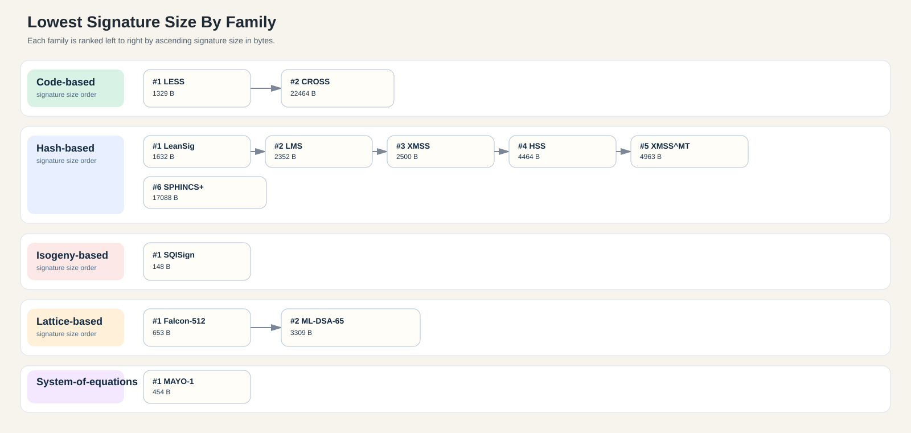
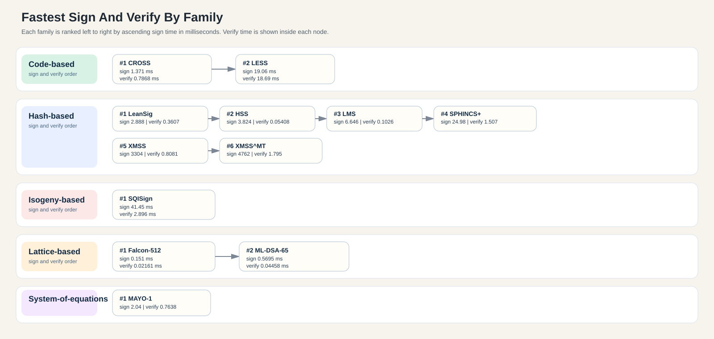

# Comparing & Benchmarking Post Quantum Digital Security Schemes

Benchmarking post-quantum signature schemes (Falcon-512, Dilithium, SPHINCS+ and more) with real performance numbers, sizes, security assumptions, implementation risks, and zkVM verification overhead to guide production-ready choices.

## Workspace schemes

Each workspace crate has a short description and the single library or reference implementation actually used by that benchmark crate.
LM-OTS is typically used inside LMS as its one-time signature component, so LMS is listed as the primary scheme here.

| No. | Signature scheme | Category | Statefulness | Description | Workspace | Library |
|---:|---|---|---|---|---|---|
| 1 | Falcon | Lattice-based | Non-stateful | Lattice-based signature scheme with small signatures. | [falcon](./crates/falcon/README.md) | [pqcrypto-falcon](https://crates.io/crates/pqcrypto-falcon) |
| 2 | Dilithium (ML-DSA) | Lattice-based | Non-stateful | Lattice-based signature scheme standardized as ML-DSA. | [dilithium](./crates/dilithium/README.md) | [ml-dsa](https://crates.io/crates/ml-dsa) |
| 3 | Lamport one-time signature (OTS) | Hash-based | Stateful | One-time hash-based signature using many random secrets. | [lamport_ots](./crates/lamport_ots/README.md) | Internal Rust implementation |
| 4 | Winternitz OTS (W-OTS) | Hash-based | Stateful | One-time hash-based signature with Winternitz chaining. | [winternitz_ots](./crates/winternitz_ots/README.md) | [winternitz-ots](https://crates.io/crates/winternitz-ots) |
| 5 | LMS | Hash-based | Stateful | Stateful Merkle tree signature scheme (RFC 8554). | [lms](./crates/lms/README.md) | [hbs-lms](https://crates.io/crates/hbs-lms) |
| 6 | HSS | Hash-based | Stateful | Hierarchical LMS for large key hierarchies. | [hss](./crates/hss/README.md) | [hbs-lms](https://crates.io/crates/hbs-lms) |
| 7 | XMSS | Hash-based | Stateful | Hash-based Merkle signature scheme (RFC 8391). | [xmss](./crates/xmss/README.md) | [xmss](https://crates.io/crates/xmss) |
| 8 | XMSSMT | Hash-based | Stateful | Multi-tree XMSS variant for faster signing. | [xmssmt](./crates/xmssmt/README.md) | [xmss](https://crates.io/crates/xmss) |
| 9 | SPHINCS+ (SLH-DSA) | Hash-based | Non-stateful | Stateless hash-based signature scheme. | [sphincs_plus](./crates/sphincs_plus/README.md) | [pqcrypto-sphincsplus](https://crates.io/crates/pqcrypto-sphincsplus) |
| 10 | SQIsign | Isogeny-based | Non-stateful | Isogeny-based signature scheme from supersingular isogenies. | [sqisign](./crates/sqisign/README.md) | [sqisign-lvl1](https://crates.io/crates/sqisign-lvl1) |
| 11 | Mayo | System-of-equations | Non-stateful | Multivariate post-quantum signature scheme (MAYO). | [mayo](./crates/mayo/README.md) | [pq-mayo](https://crates.io/crates/pq-mayo) |
| 12 | CROSS | Code-based | Non-stateful | Code-based post-quantum signature candidate (CROSS). | [cross](./crates/cross/README.md) | [CROSS C reference implementation](https://github.com/CROSS-signature/CROSS-implementation) |
| 13 | LESS | Code-based | Non-stateful | Code-based post-quantum signature candidate (LESS). | [less](./crates/less/README.md) | [LESS C implementation](https://github.com/less-sig/LESS) |

## Benchmark Summary

This table mirrors the populated `PQ DSAs.xlsx` sheet. It uses the default parameter set for each scheme and the median `divan` result for the canonical 32-byte benchmark message.

| Name | Param Set | Family | Keygen (ms) | Sign (ms) | Verify (ms) | PK (B) | SK (B) | Signature (B) |
|---|---|---|---:|---:|---:|---:|---:|---:|
| SQISign | SQISign-lvl1 | Isogeny-based | 18.56 | 41.45 | 2.896 | 65 | 353 | 148 |
| MAYO-1 | MAYO-1 | System-of-equations | 0.8444 | 2.04 | 0.7638 | 1420 | 24 | 454 |
| Falcon-512 | Falcon-512 | Lattice-based | 5.264 | 0.151 | 0.02161 | 897 | 1281 | 653 |
| LESS | LESS-252-45 | Code-based | 2.072 | 19.06 | 18.69 | 97484 | 32 | 1329 |
| LeanSig | Poseidon-L2^18-TS-w4 | Hash-based | 25090 | 2.888 | 0.3607 | 48 | 86588 | 1632 |
| LMS | LMS-SHA256-M32-H5+LMOTS-SHA256-N32-W4 | Hash-based | 6.683 | 6.646 | 0.1026 | 56 | 48 | 2352 |
| XMSS | XMSS-SHA2_10_256 | Hash-based | 1645 | 3304 | 0.8081 | 68 | 136 | 2500 |
| ML-DSA-65 (Dilithium) | ML-DSA-65 | Lattice-based | 0.2013 | 0.5695 | 0.04458 | 1952 | 4032 | 3309 |
| HSS | HSS-SHA256-H5-W2-L1 | Hash-based | 3.822 | 3.824 | 0.05408 | 60 | 48 | 4464 |
| XMSS^MT | XMSSMT-SHA2_20/2_256 | Hash-based | 1655 | 4762 | 1.795 | 68 | 135 | 4963 |
| SPHINCS+ | SPHINCS+-SHAKE-128f-simple | Hash-based | 1.498 | 24.98 | 1.507 | 32 | 64 | 17088 |
| CROSS | CROSS-RSDPG-192-BALANCED | Code-based | 0.01244 | 1.371 | 0.7868 | 83 | 48 | 22464 |

## Lowest Signature Size

Sorted by `Signature (B)` ascending.

| Rank | Name | Param Set | Family | Signature (B) | PK (B) | SK (B) | Sign (ms) | Verify (ms) |
|---:|---|---|---|---:|---:|---:|---:|---:|
| 1 | SQISign | SQISign-lvl1 | Isogeny-based | 148 | 65 | 353 | 41.45 | 2.896 |
| 2 | MAYO-1 | MAYO-1 | System-of-equations | 454 | 1420 | 24 | 2.04 | 0.7638 |
| 3 | Falcon-512 | Falcon-512 | Lattice-based | 653 | 897 | 1281 | 0.151 | 0.02161 |
| 4 | LESS | LESS-252-45 | Code-based | 1329 | 97484 | 32 | 19.06 | 18.69 |
| 5 | LeanSig | Poseidon-L2^18-TS-w4 | Hash-based | 1632 | 48 | 86588 | 2.888 | 0.3607 |
| 6 | LMS | LMS-SHA256-M32-H5+LMOTS-SHA256-N32-W4 | Hash-based | 2352 | 56 | 48 | 6.646 | 0.1026 |
| 7 | XMSS | XMSS-SHA2_10_256 | Hash-based | 2500 | 68 | 136 | 3304 | 0.8081 |
| 8 | ML-DSA-65 (Dilithium) | ML-DSA-65 | Lattice-based | 3309 | 1952 | 4032 | 0.5695 | 0.04458 |
| 9 | HSS | HSS-SHA256-H5-W2-L1 | Hash-based | 4464 | 60 | 48 | 3.824 | 0.05408 |
| 10 | XMSS^MT | XMSSMT-SHA2_20/2_256 | Hash-based | 4963 | 68 | 135 | 4762 | 1.795 |
| 11 | SPHINCS+ | SPHINCS+-SHAKE-128f-simple | Hash-based | 17088 | 32 | 64 | 24.98 | 1.507 |
| 12 | CROSS | CROSS-RSDPG-192-BALANCED | Code-based | 22464 | 83 | 48 | 1.371 | 0.7868 |

## Fastest Sign And Verify

Sorted by `Sign (ms)` ascending, with `Verify (ms)` as the secondary sort.

| Rank | Name | Param Set | Family | Sign (ms) | Verify (ms) | Signature (B) | PK (B) | SK (B) |
|---:|---|---|---|---:|---:|---:|---:|---:|
| 1 | Falcon-512 | Falcon-512 | Lattice-based | 0.151 | 0.02161 | 653 | 897 | 1281 |
| 2 | ML-DSA-65 (Dilithium) | ML-DSA-65 | Lattice-based | 0.5695 | 0.04458 | 3309 | 1952 | 4032 |
| 3 | CROSS | CROSS-RSDPG-192-BALANCED | Code-based | 1.371 | 0.7868 | 22464 | 83 | 48 |
| 4 | MAYO-1 | MAYO-1 | System-of-equations | 2.04 | 0.7638 | 454 | 1420 | 24 |
| 5 | LeanSig | Poseidon-L2^18-TS-w4 | Hash-based | 2.888 | 0.3607 | 1632 | 48 | 86588 |
| 6 | HSS | HSS-SHA256-H5-W2-L1 | Hash-based | 3.824 | 0.05408 | 4464 | 60 | 48 |
| 7 | LMS | LMS-SHA256-M32-H5+LMOTS-SHA256-N32-W4 | Hash-based | 6.646 | 0.1026 | 2352 | 56 | 48 |
| 8 | LESS | LESS-252-45 | Code-based | 19.06 | 18.69 | 1329 | 97484 | 32 |
| 9 | SPHINCS+ | SPHINCS+-SHAKE-128f-simple | Hash-based | 24.98 | 1.507 | 17088 | 32 | 64 |
| 10 | SQISign | SQISign-lvl1 | Isogeny-based | 41.45 | 2.896 | 148 | 65 | 353 |
| 11 | XMSS | XMSS-SHA2_10_256 | Hash-based | 3304 | 0.8081 | 2500 | 68 | 136 |
| 12 | XMSS^MT | XMSSMT-SHA2_20/2_256 | Hash-based | 4762 | 1.795 | 4963 | 68 | 135 |

## Lowest Signature Size By Family

Sorted by `Family`, then by `Signature (B)` ascending within each family.

| Family | Rank | Name | Param Set | Signature (B) | PK (B) | SK (B) | Sign (ms) | Verify (ms) |
|---|---:|---|---|---:|---:|---:|---:|---:|
| Code-based | 1 | LESS | LESS-252-45 | 1329 | 97484 | 32 | 19.06 | 18.69 |
| Code-based | 2 | CROSS | CROSS-RSDPG-192-BALANCED | 22464 | 83 | 48 | 1.371 | 0.7868 |
| Hash-based | 1 | LeanSig | Poseidon-L2^18-TS-w4 | 1632 | 48 | 86588 | 2.888 | 0.3607 |
| Hash-based | 2 | LMS | LMS-SHA256-M32-H5+LMOTS-SHA256-N32-W4 | 2352 | 56 | 48 | 6.646 | 0.1026 |
| Hash-based | 3 | XMSS | XMSS-SHA2_10_256 | 2500 | 68 | 136 | 3304 | 0.8081 |
| Hash-based | 4 | HSS | HSS-SHA256-H5-W2-L1 | 4464 | 60 | 48 | 3.824 | 0.05408 |
| Hash-based | 5 | XMSS^MT | XMSSMT-SHA2_20/2_256 | 4963 | 68 | 135 | 4762 | 1.795 |
| Hash-based | 6 | SPHINCS+ | SPHINCS+-SHAKE-128f-simple | 17088 | 32 | 64 | 24.98 | 1.507 |
| Isogeny-based | 1 | SQISign | SQISign-lvl1 | 148 | 65 | 353 | 41.45 | 2.896 |
| Lattice-based | 1 | Falcon-512 | Falcon-512 | 653 | 897 | 1281 | 0.151 | 0.02161 |
| Lattice-based | 2 | ML-DSA-65 (Dilithium) | ML-DSA-65 | 3309 | 1952 | 4032 | 0.5695 | 0.04458 |
| System-of-equations | 1 | MAYO-1 | MAYO-1 | 454 | 1420 | 24 | 2.04 | 0.7638 |

## Fastest Sign And Verify By Family

Sorted by `Family`, then by `Sign (ms)` ascending with `Verify (ms)` as the secondary sort within each family.

| Family | Rank | Name | Param Set | Sign (ms) | Verify (ms) | Signature (B) | PK (B) | SK (B) |
|---|---:|---|---|---:|---:|---:|---:|---:|
| Code-based | 1 | CROSS | CROSS-RSDPG-192-BALANCED | 1.371 | 0.7868 | 22464 | 83 | 48 |
| Code-based | 2 | LESS | LESS-252-45 | 19.06 | 18.69 | 1329 | 97484 | 32 |
| Hash-based | 1 | LeanSig | Poseidon-L2^18-TS-w4 | 2.888 | 0.3607 | 1632 | 48 | 86588 |
| Hash-based | 2 | HSS | HSS-SHA256-H5-W2-L1 | 3.824 | 0.05408 | 4464 | 60 | 48 |
| Hash-based | 3 | LMS | LMS-SHA256-M32-H5+LMOTS-SHA256-N32-W4 | 6.646 | 0.1026 | 2352 | 56 | 48 |
| Hash-based | 4 | SPHINCS+ | SPHINCS+-SHAKE-128f-simple | 24.98 | 1.507 | 17088 | 32 | 64 |
| Hash-based | 5 | XMSS | XMSS-SHA2_10_256 | 3304 | 0.8081 | 2500 | 68 | 136 |
| Hash-based | 6 | XMSS^MT | XMSSMT-SHA2_20/2_256 | 4762 | 1.795 | 4963 | 68 | 135 |
| Isogeny-based | 1 | SQISign | SQISign-lvl1 | 41.45 | 2.896 | 148 | 65 | 353 |
| Lattice-based | 1 | Falcon-512 | Falcon-512 | 0.151 | 0.02161 | 653 | 897 | 1281 |
| Lattice-based | 2 | ML-DSA-65 (Dilithium) | ML-DSA-65 | 0.5695 | 0.04458 | 3309 | 1952 | 4032 |
| System-of-equations | 1 | MAYO-1 | MAYO-1 | 2.04 | 0.7638 | 454 | 1420 | 24 |

