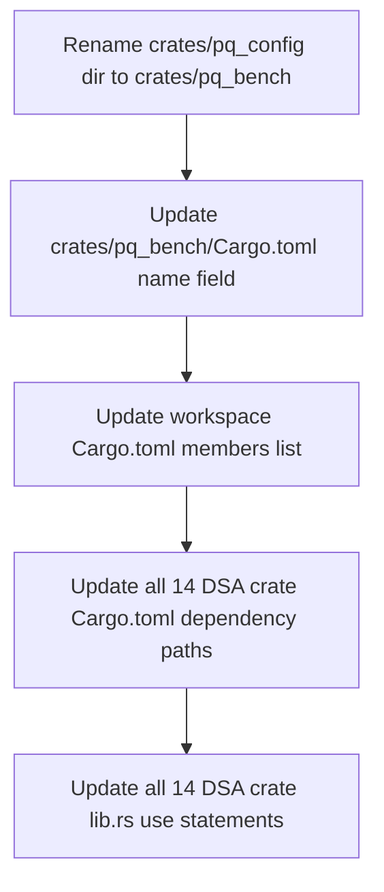

# Benchmark Runner Plan

## Overview

Add divan benchmarks to the one missing crate (leansig), rename `pq_config` → `pq_bench`, and create a unified benchmark runner binary that collects keygen/sign/verify timing + key/signature sizes across all 14 PQ DSA crates, outputting results to CSV.

## Current State

### Crates with divan benchmarks (13/14 DSA crates)
All crates except `leansig` already have `benches/<name>_divan.rs`:
- `cross`, `dilithium`, `falcon`, `hss`, `less`, `lms`, `mayo`, `sphincs_plus`, `sqisign`, `winternitz_ots`, `xmss`, `xmssmt`

### Missing: `leansig`
- No `benches/` directory
- Uses epoch-based signing API: `S::key_gen()`, `S::sign(&sk, epoch, &message)`, `S::verify(&pk, epoch, &message, &sig)`
- Requires `prepare_sk_for_epoch()` before signing
- Uses `Serializable::to_bytes()` for size measurement

### Utility crate: `pq_config`
- Provides `BENCH_MESSAGE` constant (32-byte SHA-256 digest)
- Referenced by all 14 DSA crates
- Will be renamed to `pq_bench` and expanded with the runner binary

---

## Task 1A: Add Divan Benchmark to LeanSig

### Files to create
- `crates/leansig/benches/leansig_divan.rs`

### Files to modify
- `crates/leansig/Cargo.toml` — add `[dev-dependencies] divan = "0.1"` and `[[bench]]` section

### Benchmark structure
Following the pattern from other crates, the leansig divan benchmark will have:
- `keygen` bench — calls `S::key_gen()`
- `sign` bench — generates keypair, prepares SK for epoch, then benchmarks `S::sign()`
- `verify` bench — generates keypair + signature, then benchmarks `S::verify()`
- `print_sizes()` — outputs pk/sk/sig sizes via `Serializable::to_bytes().len()`
- `main()` — calls `print_sizes()` then `divan::main()`

### Key considerations
- LeanSig keygen is ~7s, so divan will auto-adjust iteration count
- Must call `prepare_sk_for_epoch()` in setup, not in the timed section
- Use `SIGTargetSumLifetime18W4NoOff` as the concrete type (same as main.rs)

---

## Task 1B: Rename `pq_config` → `pq_bench`

### Scope of changes



### Files to modify

**Directory rename:**
- `crates/pq_config/` → `crates/pq_bench/`

**Cargo.toml updates (16 files):**
1. `Cargo.toml` (workspace) — change `crates/pq_config` → `crates/pq_bench`
2. `crates/pq_bench/Cargo.toml` — change `name = "pq_config"` → `name = "pq_bench"`
3. 14 DSA crate `Cargo.toml` files — change `pq_config = { path = "../pq_config" }` → `pq_bench = { path = "../pq_bench" }`

**Rust source updates (15 files):**
- 14 DSA crate `src/lib.rs` files — change `pub use pq_config::BENCH_MESSAGE` → `pub use pq_bench::BENCH_MESSAGE`
- `crates/pq_bench/src/lib.rs` — update doc comment reference

---

## Task 2: Benchmark Runner Binary

### Architecture


### Task 2A: Runner binary in `pq_bench`

Add to `crates/pq_bench/Cargo.toml`:
- `[[bin]] name = "bench_runner"` pointing to `src/bin/bench_runner.rs`
- Dependencies on all 14 DSA crates (as regular dependencies, gated behind a feature or just always included)
- `clap` for CLI argument parsing (--runs N)

The runner binary:
1. Parses CLI args: `--runs N` (default 10), `--output PATH` (default `benchmarks/results.csv`)
2. Iterates over all registered DSA adapters
3. For each adapter, runs N iterations of keygen, sign, verify
4. Collects median/mean timing
5. Collects sizes (once, from first run)
6. Prints progress to terminal
7. Writes CSV at the end

### Task 2B: Common `BenchResult` struct

Define in `crates/pq_bench/src/lib.rs` or a submodule:

```rust
pub struct BenchResult {
    pub algorithm: String,
    pub param_set: String,
    pub keygen_median_ns: u128,
    pub sign_median_ns: u128,
    pub verify_median_ns: u128,
    pub public_key_bytes: usize,
    pub secret_key_bytes: usize,
    pub signature_bytes: usize,
}
```

And a trait:

```rust
pub trait DsaBenchmark {
    fn name(&self) -> &str;
    fn param_set(&self) -> &str;
    fn run_once(&self, message: &[u8]) -> BenchRun;
}

pub struct BenchRun {
    pub keygen_ns: u128,
    pub sign_ns: u128,
    pub verify_ns: u128,
    pub public_key_bytes: usize,
    pub secret_key_bytes: usize,
    pub signature_bytes: usize,
}
```

### Task 2C: Implement adapters for all 14 DSA crates

Each adapter implements `DsaBenchmark` by calling the crate's keygen/sign/verify API and measuring with `Instant::now()`. The adapters live in `crates/pq_bench/src/bin/bench_runner.rs` or in a `crates/pq_bench/src/adapters/` module.

**Crate API patterns (3 categories):**

| Pattern | Crates | API Style |
|---------|--------|-----------|
| Trait-based scheme | dilithium, falcon, sphincs_plus, mayo, winternitz_ots | `scheme.keypair()`, `scheme.sign()`, `scheme.verify()` |
| Stateful hash-based | hss, lms, xmss, xmssmt | `scheme.keypair()`, `scheme.sign(&mut sk)`, `scheme.verify()` |
| FFI-based | cross, less, sqisign | `scheme.benchmark_keypair()`, `scheme.sign_message()`, `scheme.verify_message()` |
| Epoch-based | leansig | `S::key_gen()`, `S::sign(&sk, epoch, &msg)`, `S::verify()` |

### Task 2D: CSV output

Output file: `benchmarks/results.csv`

CSV columns:
```
algorithm,param_set,keygen_median_ns,sign_median_ns,verify_median_ns,public_key_bytes,secret_key_bytes,signature_bytes
```

Also print a formatted ASCII table to stdout after completion.

### Task 2E: Makefile target

```makefile
RUNS ?= 10

run:
	cargo run --release --bin bench_runner -- --runs $(RUNS)
```

Usage:
- `make run` — runs with default 10 iterations
- `make run RUNS=1` — fast single run
- `make run RUNS=100` — thorough benchmarking

### Task 2F: Terminal status printing

During execution, print:
```
[1/14] Benchmarking Dilithium (ML-DSA-65)... 10 runs
  ✓ keygen: median 1.23ms
  ✓ sign:   median 2.45ms
  ✓ verify: median 0.89ms
[2/14] Benchmarking Falcon-512... 10 runs
  ...
```

---

## File Change Summary

### New files
| File | Purpose |
|------|---------|
| `crates/leansig/benches/leansig_divan.rs` | Divan benchmark for leansig |
| `crates/pq_bench/src/bin/bench_runner.rs` | Unified benchmark runner binary |
| `benchmarks/.gitkeep` | Directory for CSV output |

### Modified files
| File | Change |
|------|--------|
| `crates/leansig/Cargo.toml` | Add divan dev-dep + bench section |
| `crates/pq_bench/Cargo.toml` | Rename + add deps on all DSA crates + clap |
| `crates/pq_bench/src/lib.rs` | Add BenchResult/DsaBenchmark types, update doc |
| `Cargo.toml` (workspace) | Update member path |
| `Makefile` | Add `run` target |
| 14× `crates/*/Cargo.toml` | Update pq_config → pq_bench dep |
| 14× `crates/*/src/lib.rs` | Update `use pq_config::` → `use pq_bench::` |

### Renamed
| From | To |
|------|-----|
| `crates/pq_config/` | `crates/pq_bench/` |

---

## Dependency Graph for bench_runner

```mermaid
graph TD
    R[bench_runner binary] --> PB[pq_bench lib]
    R --> D[dilithium]
    R --> F[falcon]
    R --> SP[sphincs_plus]
    R --> M[mayo]
    R --> W[winternitz_ots]
    R --> LMS[lms]
    R --> HSS[hss]
    R --> X[xmss]
    R --> XMT[xmssmt]
    R --> CR[cross]
    R --> SQ[sqisign]
    R --> LE[leansig]
    R --> LESS[less]
    D --> PB
    F --> PB
    SP --> PB
    M --> PB
    L --> PB
    W --> PB
    LMS --> PB
    HSS --> PB
    X --> PB
    XMT --> PB
    CR --> PB
    SQ --> PB
    LE --> PB
    LESS --> PB
