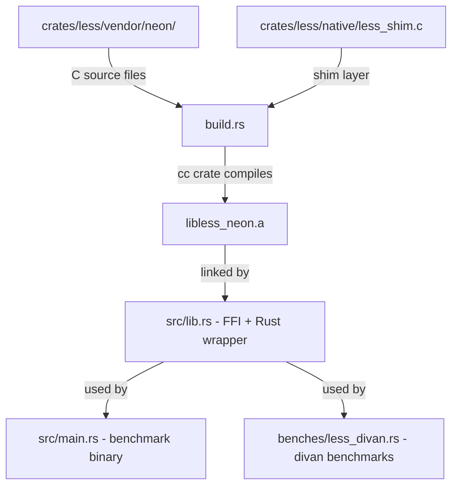

# LESS Crate Implementation Plan

## Goal

Create a new `crates/less` crate that wraps the LESS post-quantum signature scheme (C implementation) and provides benchmarking, following the exact same pattern as `crates/cross`.

## Background

**LESS** is a code-based post-quantum digital signature scheme. It is only available as a C implementation from [less-sig/LESS](https://github.com/less-sig/LESS). Like CROSS, it follows the NIST API (`crypto_sign_keypair`, `crypto_sign`, `crypto_sign_open`).

**Target variant**: `LESS-252-45` (smallest parameter set)  
**Implementation**: NEON optimized (for Apple M-series)  
**Vendoring**: Copy source files directly into `crates/less/vendor/neon/`

## Architecture

The crate mirrors `crates/cross` exactly:



## File Structure

```
crates/less/
├── vendor/
│   └── neon/
│       ├── include/       # Header files from LESS Optimized_Implementation NEON
│       │   ├── api.h
│       │   ├── ... other LESS headers
│       └── lib/           # C source files
│           ├── ... LESS .c files
├── native/
│   └── less_shim.c        # Thin C shim providing RNG init + size query functions
├── build.rs               # cc::Build compiling all LESS C sources + shim
├── Cargo.toml             # Package config with cc build-dep, divan dev-dep
├── README.md              # Documentation
├── benches/
│   └── less_divan.rs      # Divan microbenchmarks
└── src/
    ├── lib.rs             # FFI extern declarations + Rust wrapper types
    └── main.rs            # Single-run benchmark binary
```

## Detailed Steps

### Step 1: Clone LESS repo and vendor NEON source files

Clone `git@github.com:less-sig/LESS.git` to a temporary location, then copy the NEON optimized implementation for the `LESS-252-45` parameter set into `crates/less/vendor/neon/`. The directory structure should mirror what CROSS does with `vendor/reference/include/` and `vendor/reference/lib/`.

Key considerations:
- The LESS repo organizes optimized implementations under `Optimized_Implementation/neon/`
- We need to identify which subdirectory corresponds to the `252-45` parameter set
- Copy all `.h` files into `vendor/neon/include/` and all `.c` files into `vendor/neon/lib/`
- Include the LICENSE file

### Step 2: Create the C shim (`native/less_shim.c`)

Following the pattern from [`cross_shim.c`](crates/cross/native/cross_shim.c), create a thin C shim that:

1. Provides a `less_rs_init_rng()` function to initialize the deterministic RNG state
2. Implements the `randombytes()` function that LESS calls internally for randomness
3. Provides `less_rs_public_key_bytes()`, `less_rs_secret_key_bytes()`, `less_rs_signature_bytes()` size query functions that return `CRYPTO_PUBLICKEYBYTES`, `CRYPTO_SECRETKEYBYTES`, and `CRYPTO_BYTES`

The exact RNG initialization will depend on what LESS uses internally. CROSS uses `csprng_hash.h` with `CSPRNG_STATE_T` and `csprng_initialize()`. LESS likely has its own RNG mechanism - we need to inspect the vendored headers to determine the correct approach. If LESS simply expects a `randombytes()` function to be provided externally, we can implement it with a simple SHAKE-based PRNG seeded from our deterministic seed.

### Step 3: Create `build.rs`

Following [`build.rs`](crates/cross/build.rs), create a build script that:

1. Sets up paths: `vendor_dir`, `include_dir`, `lib_dir`, `native_dir`
2. Uses `cc::Build` to compile all LESS `.c` files plus the shim
3. Adds appropriate `-D` defines for the `252-45` parameter set
4. Adds `-std=c99` flag (LESS is C99, CROSS is C11)
5. Links math library with `cargo:rustc-link-lib=m`
6. Sets `cargo:rerun-if-changed` directives

The exact defines and source file list will be determined after inspecting the vendored LESS source.

### Step 4: Create `Cargo.toml`

```toml
[package]
name = "less"
version.workspace = true
edition.workspace = true

[[bin]]
name = "less"
path = "src/main.rs"

[[bench]]
name = "less_divan"
harness = false

[dependencies]

[build-dependencies]
cc = "1"

[dev-dependencies]
divan = "0.1"
```

### Step 5: Create `src/lib.rs`

Following [`lib.rs`](crates/cross/src/lib.rs:1), implement:

1. **Constants**: `BENCH_MESSAGE_SIZES`, `BENCH_MESSAGE_BYTE`, `LESS_VARIANT` name string, seed bytes, RNG profiles
2. **Memory tracking**: `TrackingAllocator`, `ALLOCATED`, `PEAK_ALLOCATED`, `BASELINE` atomics, `memory` module with `reset_peak()` and `peak_bytes()`
3. **Types**: `LessKeyPair`, `LessSignature`, `LessSizes`, `LessError` enum, `LessScheme` struct
4. **`LessScheme` impl**: `algorithm_name()`, `keypair()`, `benchmark_keypair()`, `sign()` / `sign_message()`, `verify()` / `verify_message()`, size query methods
5. **`NativeLess` impl**: `dimensions()`, `with_rng()`, `keypair()`, `sign()`, `verify()` - all behind a `LESS_FFI_LOCK` mutex
6. **Helper functions**: `bench_message()`, `signed_message_size()`, `measure_time()`, `init_rng()`, `extract_signature()`, `combine_signed_message()`, `matches_opened_message()`
7. **FFI extern block**: `crypto_sign_keypair`, `crypto_sign`, `crypto_sign_open`, `less_rs_init_rng`, `less_rs_public_key_bytes`, `less_rs_secret_key_bytes`, `less_rs_signature_bytes`
8. **Tests**: roundtrip sign/verify test, helper function tests

### Step 6: Create `src/main.rs`

Following [`main.rs`](crates/cross/src/main.rs:1), implement a benchmark binary that:

1. Sets up `TrackingAllocator` as global allocator
2. Runs keygen with timing
3. Runs sign with timing + peak memory tracking
4. Runs verify with timing + peak memory tracking
5. Prints size measurements
6. Prints summary

### Step 7: Create `benches/less_divan.rs`

Following [`cross_divan.rs`](crates/cross/benches/cross_divan.rs:1), implement divan benchmarks for:

1. `keygen` benchmark
2. `sign` benchmark across `BENCH_MESSAGE_SIZES`
3. `verify` benchmark across `BENCH_MESSAGE_SIZES`
4. Size and memory usage printing before divan runs

### Step 8: Create `README.md`

Document the crate following the CROSS README pattern, covering:
- Overview of LESS
- Links to upstream
- Variant details (252-45 parameter set)
- Implementation notes (NEON optimized, FFI wrapper, deterministic RNG)
- How to run the benchmark binary
- How to run divan benchmarks

### Step 9: Add to workspace

Add `"crates/less"` to the `members` list in the root [`Cargo.toml`](Cargo.toml:1).

### Step 10: Build and test

1. `cargo build -p less` - verify compilation
2. `cargo test -p less` - verify roundtrip test passes
3. `cargo run -p less --bin less` - verify benchmark binary runs
4. `cargo bench -p less --bench less_divan` - verify divan benchmarks run

## Key Risks and Mitigations

| Risk | Mitigation |
|------|------------|
| LESS RNG interface differs from CROSS | Inspect LESS headers after cloning; adapt shim accordingly. LESS likely expects an external `randombytes` function. |
| LESS parameter set selection via defines is different | Inspect LESS CMakeLists.txt and parameter headers to find correct `-D` flags for 252-45 |
| NEON intrinsics require specific compiler flags | Add `-march=armv8-a+simd` or similar flags in build.rs; test on Apple M-series |
| LESS source file organization differs from CROSS | Adapt build.rs file list after inspecting vendored sources |
| LESS uses different NIST API function signatures | Unlikely - NIST API is standardized, but verify after vendoring |
